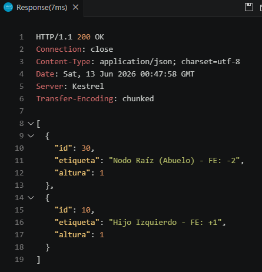
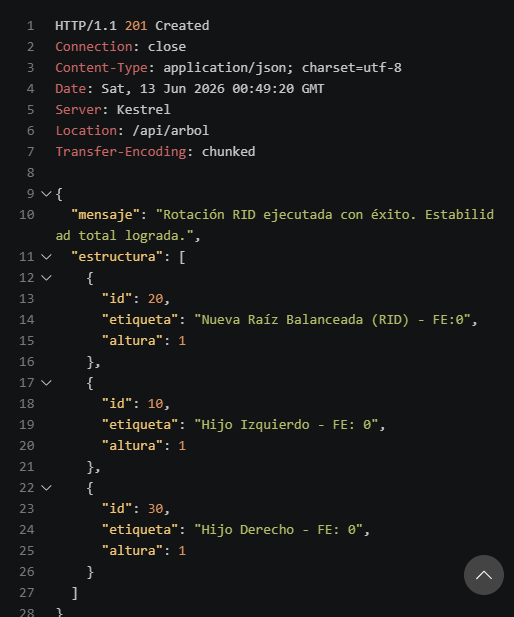
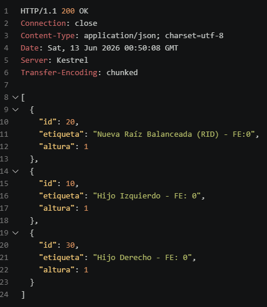

# Actividad: Balanceo Compuesto en Árboles AVL y Exposición vía Web APIs
 
**Fecha:** 12 de junio de 2026  
**Yosselin Aracely Oxlaj González**
**202503415** 
**Link del repor(es el mismo): https://github.com/yaog06/Actividades_IPC2_Yosselin_Oxlaj_202503415_2026 **
---
 
## Parte 1: Investigación Teórica y Análisis de Casos
 
### 1.1 El Límite de las Rotaciones Simples y Desbalanceo en "Zig-Zag"
 
#### El Problema Cruzado
 
Una **rotación simple** (RLL o RRD) asume que el desbalance está "alineado" en una sola dirección: el hijo problemático se inclina hacia el mismo lado que el nodo padre desbalanceado. Cuando esto se cumple, el pivote puede subir un nivel y el árbol queda equilibrado.
 
Sin embargo, con la secuencia de inserción **30 → 10 → 20**, el desbalance adopta una forma de **Zig-Zag** (o caso cruzado):

```
      30          (FE: -2)
     /
   10             (FE: +1)
     \
      20
```
 
Aquí el nodo padre (30) está desbalanceado hacia la **izquierda** (FE = −2), pero su hijo (10) se inclina hacia la **derecha** (FE = +1). Si se aplica una rotación simple RLL sobre el nodo 30, el árbol resultante sería:
 
```
      10
        \
         30
        /
       20
```
 
El desbalance **no se resuelve**, simplemente *cambia de lado*: ahora la inclinación es hacia la derecha en lugar de la izquierda. La rotación simple no puede corregir este caso porque no maneja el "quiebre de dirección" entre el padre y el hijo.
 
**Condición matemática que gatilla una Rotación Doble Izquierda-Derecha (RID):**
 
Sea `p` el nodo padre desbalanceado e `h` su hijo:
 
$$FE(p) = -2 \quad \text{y} \quad FE(h) = +1$$
 
Es decir: el padre tiene sobrepeso en el subárbol **izquierdo** (FE = −2) pero el hijo izquierdo tiene sobrepeso en su subárbol **derecho** (FE = +1). La combinación de signos opuestos define el caso cruzado Izquierda-Derecha.
 
---
 
#### Principio DRY (Don't Repeat Yourself)
 
Implementar las rotaciones compuestas **RID** y **RDI** como composición de las primitivas simples (RLL y RRD) tiene una ventaja de ingeniería clave: **evita duplicar la lógica de reasignación de punteros**.
 
Una reasignación manual desde cero implica razonar sobre 4–6 referencias de punteros simultáneamente, lo que es propenso a errores sutiles (por ejemplo, romper la referencia al padre del subárbol pivote).
 
En cambio, reutilizando las primitivas:
 
```
RID(nodo_padre):
    RRD(nodo_padre.HijoIzquierdo)   // Paso 1: rotación simple sobre el hijo
    RLL(nodo_padre)                 // Paso 2: rotación simple sobre el padre
```
 
Cada primitiva ya está **validada y probada de forma aislada**. Los beneficios concretos son:
 
| Criterio | Punteros manuales | Composición de primitivas |
|---|---|---|
| Líneas de código | ~20–30 | ~4–6 |
| Riesgo de bugs | Alto | Bajo (reutiliza código probado) |
| Mantenibilidad | Difícil | Fácil (cambiar una primitiva actualiza ambas rotaciones dobles) |
| Legibilidad | Baja | Alta (el nombre de la función comunica la intención) |
 
---
 
### 1.2 Fundamentos de Arquitectura Web y Protocolo HTTP
 
#### El Modelo Cliente-Servidor
 
Cuando un **cliente web** (por ejemplo, un navegador o una herramienta como `curl`) solicita un recurso a un servidor, los componentes que interactúan son:
 
1. **Cliente:** Genera una **Request** (petición HTTP) que incluye:
   - **Línea de inicio:** Método HTTP + URL + versión del protocolo (ej. `GET /api/arbol HTTP/1.1`).
   - **Headers:** Metadatos como `Content-Type`, `Accept`, `Authorization`, etc.
   - **Body (cuerpo):** Opcional; presente en métodos como POST con el payload de datos.
2. **Servidor (ASP.NET Core):** Recibe la petición, la enruta al endpoint correspondiente, ejecuta la lógica de negocio y genera una **Response** (respuesta HTTP) que contiene:
   - **Código de estado:** Ej. `200 OK`, `201 Created`, `400 Bad Request`.
   - **Headers de respuesta:** Ej. `Content-Type: application/json`.
   - **Body:** El recurso solicitado, generalmente en formato JSON.

   #### Semántica de Operaciones: GET vs POST
 
| Característica | GET | POST |
|---|---|---|
| **Propósito semántico** | **Recuperación** de un recurso (lectura) | **Mutación / creación** de un recurso |
| **Cuerpo (Body)** | No lleva body | Lleva el payload en el body |
| **Idempotencia** | Sí — múltiples llamadas iguales producen el mismo resultado | No — cada llamada puede crear un recurso nuevo |
| **Visibilidad de datos** | Los parámetros van en la URL (query string) | Los datos van cifrados en el body (más seguro para datos sensibles) |
| **Caché** | Las respuestas pueden cachearse | No se cachea por defecto |

## Parte practica
### Prueba Get inicial


### Prueba Post


### Prueba de Verificación

