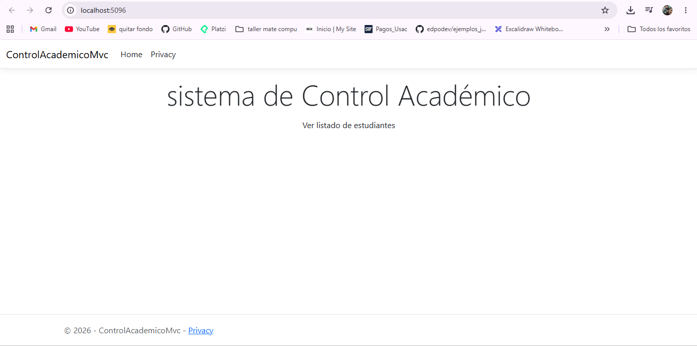
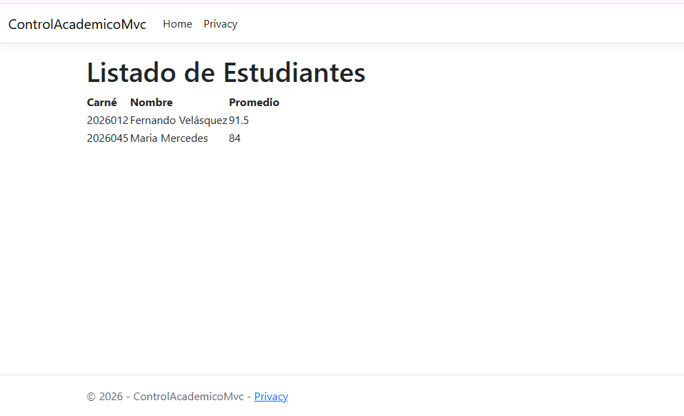

# Actividad de Laboratorio: Arquitectura Multi-Nivel (N-Tier) y Patrón Lógico de Software (MVC) en .NET

**Fecha:** 17 de junio de 2026

Link del repositorio: https://github.com/yaog06/Actividades_IPC2_Yosselin_Oxlaj_202503415_2026

Yosselin Aracely Oxlaj González
202503415
 
---

## Parte 1: Fundamentación Teórica y Análisis Crítico

### 1. El Tránsito hacia los Sistemas Distribuidos y Multi-Capa

#### - La limitación del Monolito Local: 
Cuando la interfaz, la lógica de negocio y el almacenamiento de datos residen exclusivamente en una sola máquina física, el sistema queda atado a la capacidad de ese único equipo. No existe forma de escalar un componente de manera independiente: si la carga de usuarios crece, no se puede simplemente añadir más servidores web, porque la base de datos y la lógica están soldadas al mismo proceso. Además, si esa máquina falla, la aplicación completa deja de estar disponible (no hay redundancia ni tolerancia a fallos). En cuanto a la sincronización, al haber una sola copia de los datos en disco local, cualquier intento de escalar horizontalmente (agregar más instancias de la aplicación) genera inconsistencias, porque cada instancia tendría su propia copia de los datos sin un mecanismo central que las mantenga sincronizadas.

#### - Distinción Crítica (Layers vs Tiers):

**Layers (Capas)**: El término capa se refiere a una separación lógica del código. En otras palabras, es un conjunto coherente de funcionalidades relacionadas.

Estructurar las aplicaciones en capas es una forma de organizar mejor nuestro código. Por esta razón, la portabilidad y la mantenibilidad son factores clave que nos impulsan a utilizar este tipo de estructura.

**Tiers (Niveles)**: Un nivel se refiere a la separación física de componentes en un sistema distribuido. Los niveles describen cómo se implementan los componentes de una aplicación en diferentes servidores o entornos, lo que puede afectar el rendimiento, la escalabilidad y la seguridad.

En conclusión **layers** es una decisión de diseño de sotfware y **tiers** es una decisión de despliegue de infraestructura.

#### - Responsabilidad en la Aquitectura de 3 niveles:

**Nivel 1 - Capa de Presentación (Presentación Tier):** Es la capa de interfaz de usuario que interactúa directamente con los usuarios. Es responsable de mostrar información, capturar la entrada del usuario y proporcionar una experiencia de usuario fluida.

Responsabilidades:

- Renderiza los componentes de la interfaz de usuario y gestiona las interacciones del usuario.
- Validar la entrada del usuario en el lado del cliente antes de enviar las solicitudes al servidor.
- Garantizar un diseño adaptable a diversos dispositivos, incluidos ordenadores de escritorio, tabletas y teléfonos inteligentes.

**Nivel 2 - Capa de Aplicación o Negocio (Application Tier):** Contiene la funcionalidad principal de la aplicación. Procesa las solicitudes de los usuarios, aplica las reglas de negocio y toma decisiones en función de la información recibida.

Responsabilidades:

- Implementar reglas y lógica de negocio para la manipulación de datos.
- Gestionar las sesiones de usuario y el estado de la aplicación.
- Interactúa con la capa de acceso a datos para obtener y almacenar datos.

**Nivel 3 - Capa de Datos (Data Tier):** Consiste en el almacenamiento de datos propiamente dicho, que puede ser una base de datos relacional, una base de datos NoSQL u otros sistemas de almacenamiento.

Responsabilidades:

- Almacena datos estructurados y no estructurados de forma eficiente.
- Garantizar la integridad de los datos e implementar técnicas de normalización para eliminar la redundancia.
- Proporcionar mecanismos para la copia de seguridad y la recuperación de datos.

#### - Seguridad Perimetral:
Exponer públicamente el puerto de una base de datos a internet es un error crítico porque convierte a la base de datos en un blanco directo de ataques (fuerza bruta, inyección, explotación de vulnerabilidades del motor de base de datos) sin que la petición pase primero por las validaciones, reglas de negocio y controles de acceso que normalmente impone la capa de aplicación. Es decir, se elimina por completo la "barrera" que protege a los datos. La buena práctica recomendada es ubicar la base de datos en una red privada o subred aislada (sin IP pública), permitiendo el acceso únicamente desde la capa de aplicación mediante reglas de firewall restrictivas, y reservar el acceso administrativo directo solo a través de un *bastion host* o VPN, nunca expuesto directamente a internet.

### 2. Desacoplamiento Lógico con el Patrón MVC
#### - La crisis del codigo espagueti:
Mezclar sentencias SQL, lógica matemática y etiquetas visuales en un mismo archivo genera **alto acoplamiento** y **baja cohesión**: un cambio en el diseño visual obliga a tocar el mismo archivo donde vive la lógica de negocio y el acceso a datos, aumentando el riesgo de introducir errores en partes no relacionadas. Para el mantenimiento, esto significa que entender o modificar una sola responsabilidad exige leer y comprender código de las otras tres a la vez. Para las pruebas unitarias, el efecto es aún más grave: es prácticamente imposible probar la lógica de negocio de forma aislada, porque está entrelazada con el acceso a la base de datos y con el marcado HTML; no se puede simular ("mockear") la base de datos sin reescribir buena parte del archivo, lo que en la práctica elimina la posibilidad de automatizar pruebas.

#### - Separación de Preocupaciones (Soc):
- **Modelo:** representa los datos y las reglas del dominio del negocio (entidades, validaciones, cálculos). No debe conocer absolutamente nada sobre cómo esos datos se presentan al usuario; esto permite que el mismo modelo se reutilice frente a distintas vistas (web, móvil, API) sin modificarse.

- **Vista:** se define como una entidad *pasiva* porque únicamente se limita a mostrar la información que recibe, sin tomar decisiones de negocio. Tiene estrictamente prohibido contener sentencias SQL, cálculos de negocio o lógica de validación; solo debe incluir lógica de presentación mínima (iteraciones para mostrar listas, condicionales de formato visual).
- **Controlador:** actúa como intermediario táctico: recibe la petición del usuario, decide qué operación del Modelo invocar, y selecciona qué Vista debe renderizarse con los resultados. Es el "director de orquesta" porque coordina el flujo de la petición sin ejecutar él mismo la lógica de negocio ni el renderizado.

#### - Métricas de Ingeniería de Sotware: 
El patrón MVC favorece una **alta cohesión** porque cada componente agrupa exclusivamente las responsabilidades que le corresponden (el Modelo solo datos y reglas, la Vista solo presentación, el Controlador solo orquestación), de modo que cada clase tiene un único motivo para cambiar. Al mismo tiempo, favorece un **bajo acoplamiento** porque los tres componentes se comunican mediante interfaces bien definidas (el Controlador no necesita conocer los detalles internos del Modelo ni de la Vista), lo que permite modificar o sustituir una pieza —por ejemplo, cambiar el motor de base de datos o el framework de la interfaz— sin reescribir las otras dos. En un entorno profesional, esto se traduce en equipos que pueden trabajar en paralelo (un desarrollador en la Vista, otro en el Modelo) y en código más fácil de probar, mantener y escalar.

---

## Parte 2: Modelo del Ciclo de Vida y Enrutameinto Semántico

### 1. Mapeo Analítico de URLs

Plantilla de enrutamiento por convención: `{controller=Home}/{action=Index}/{id?}`

| URL Entrante del Cliente | Clase Controladora Buscada | Método (Acción) Ejecutado | Parámetro `id` Inyectado |
|---|---|---|---|
| `https://ingenieria.usac.edu.gt/ControlAcademico/Login` | `ControlAcademicoController` | `Login` | (Ninguno) |
| `https://ingenieria.usac.edu.gt/Estudiante/Historial/20260123` | `EstudianteController` | `Historial` | `20260123` |
| `https://ingenieria.usac.edu.gt/Asignacion/Detalle/10` | `AsignacionController` | `Detalle` | `10` |
| `https://ingenieria.usac.edu.gt/Home` | `HomeController` | `Index` (valor por defecto, el segmento no fue enviado) | (Ninguno / Opcional) |

### 2. Diagramación del Flujo Interactivo

1. **Clic del usuario (Capa de Presentación):** el usuario hace clic en un botón/enlace dentro del navegador. El navegador construye una petición HTTP (GET o POST) dirigida a una URL específica y la envía a través de la red hacia el servidor.
2. **Enrutamiento (Routing Engine):** el servidor (Kestrel) recibe la petición y el middleware `UseRouting` la compara contra la plantilla `{controller}/{action}/{id?}` para determinar qué clase Controladora y qué método Acción deben atender la solicitud.
3. **Intervención del Controlador:** el framework instancia el Controlador correspondiente y ejecuta el método de Acción. El Controlador valida los datos de entrada (validación perimetral) y delega el trabajo pesado invocando al Modelo, sin ejecutar él mismo cálculos de negocio ni acceso directo a la base de datos.
4. **Intervención del Modelo:** el Modelo procesa la solicitud (consulta o modifica los datos del dominio aplicando sus reglas de negocio) y devuelve al Controlador los objetos de datos resultantes, completamente ajenos a cómo se presentarán.
5. **Intervención de la Vista y respuesta al cliente:** el Controlador selecciona la Vista adecuada y le inyecta los datos del Modelo mediante `return View(modelo)`. El motor de vistas (Razor) combina la plantilla con los datos y genera el HTML final, el cual viaja de vuelta por la red hasta el navegador, donde se renderiza dinámicamente para el usuario.

---

## Parte 5: Referencias Bibliográficas

> Facultad de Ingeniería, USAC. (2026). *Sesión 11: Modelado Base y Arquitecturas de Despliegue. Evolución de Sistemas Distribuidos, Fundamentos del Modelo Cliente-Servidor y Diseño Físico Multi-Capas (N-Tier)*. Laboratorio del curso Introducción a la Programación y Computación 2. Guatemala.

> Facultad de Ingeniería, USAC. (2026). *Sesión 12: Arquitectura y Componentes del Patrón MVC. Desacoplamiento Lógico de Software, Ciclo de Vida de las Peticiones y Enrutamiento en Aplicaciones Interactivas Modernas*. Laboratorio del curso Introducción a la Programación y Computación 2. Guatemala.

**Otras:**
https://www.baeldung.com/cs/layers-vs-tiers
https://medium.com/@i.vikash/layers-vs-tiers-clarifying-confusion-in-software-development-with-examples-ffc4393916f4

## Imagenes

