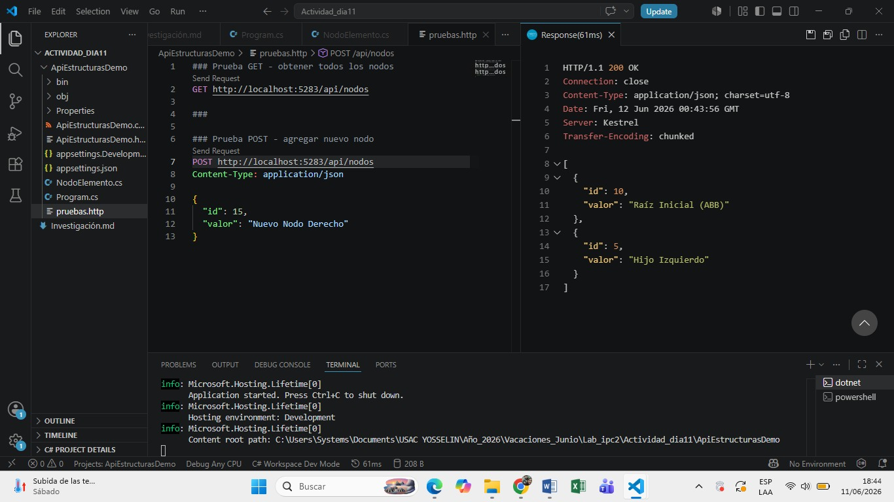
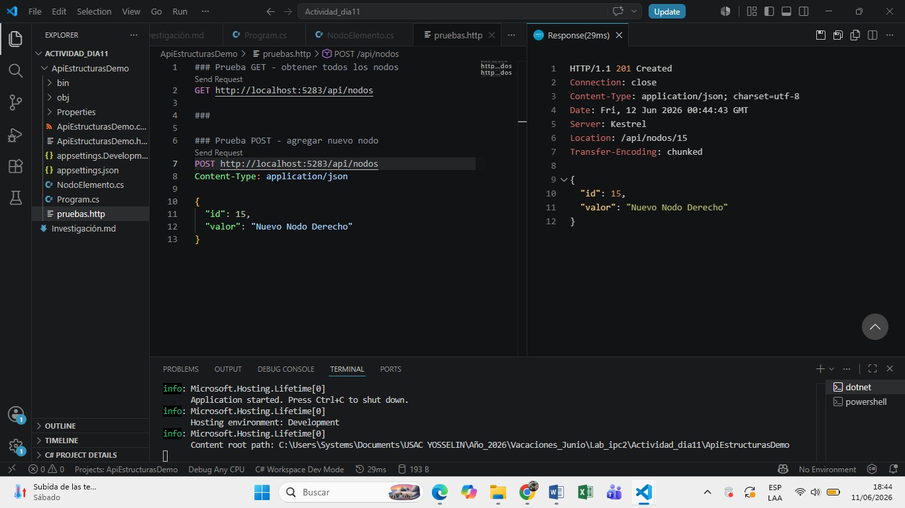
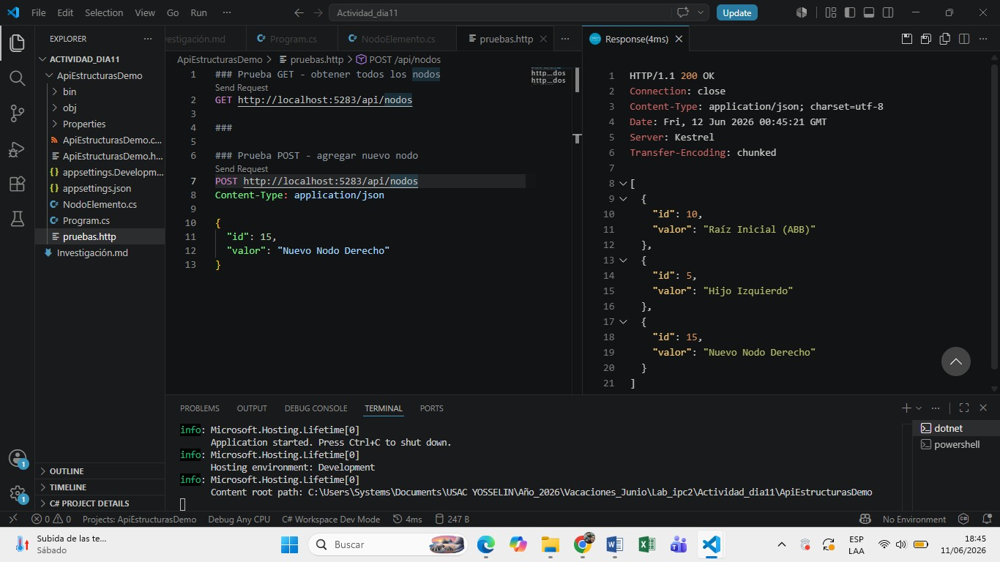

# Actividad de Investigación y Práctica: Estructuras de Datos Avanzadas y APIs con ASP.NET Core

**Fecha:** 11 de junio de 2026

Link del repositorio: https://github.com/yaog06/Actividades_IPC2_Yosselin_Oxlaj_202503415_2026/tree/main/ApiEstructurasDemo

Yosselin Aracely Oxlaj González
202503415
 
---
 
## Parte 1: Investigación Teórica
 
### 1. Estructuras de Datos Eficientes
 
#### Árboles Binarios de Búsqueda (ABB)
 
Un **Árbol Binario de Búsqueda** organiza sus nodos siguiendo una regla de ordenamiento estricta:
 
- Todo valor en el **subárbol izquierdo** de un nodo es **menor** que el valor de dicho nodo.
- Todo valor en el **subárbol derecho** de un nodo es **mayor** que el valor de dicho nodo.
Esta propiedad permite realizar búsquedas eficientes en promedio $O(\log n)$, ya que en cada nivel se descarta la mitad del árbol.
 
**Principal desventaja — degeneración en lista vinculada:**  
Si los datos se insertan en orden secuencial (ya sea ascendente o descendente), el ABB degenera en una estructura lineal. Por ejemplo, al insertar los valores `10 → 20 → 30 → 40`, cada nuevo nodo se convierte en el hijo derecho del anterior, produciendo una cadena sin ramificaciones. En este caso, la altura del árbol pasa de $O(\log n)$ a $O(n)$, lo que deteriora todas las operaciones (búsqueda, inserción, eliminación) a complejidad lineal: el peor caso posible.

#### Árboles AVL
 
Un **árbol AVL** (Adelson-Velsky y Landis) es un árbol binario de búsqueda **auto-balanceado**. Esto significa que, después de cada inserción o eliminación, el árbol se reorganiza automáticamente (mediante rotaciones) para garantizar que ningún subárbol quede demasiado profundo respecto al otro.

**Factor de balanceo:**
 
$$Factor = Altura_{Izquierda} - Altura_{Derecha}$$
 
En un árbol AVL, el factor de balanceo de **todo nodo** debe mantenerse en el conjunto $\{-1, 0, 1\}$. Si una operación produce un factor de $-2$ o $+2$ en algún nodo, se aplica una rotación (simple o doble) para restablecer el equilibrio.

**¿Por qué la complejidad se mantiene en $O(\log n)$?**  
Al garantizar que el factor de balanceo nunca supera $\pm 1$, la altura del árbol siempre es proporcional a $\log n$, independientemente del orden de inserción. Como la altura máxima está acotada, las operaciones de búsqueda, inserción y eliminación recorren a lo sumo $O(\log n)$ niveles, manteniendo esa complejidad incluso en el peor caso, a diferencia del ABB simple.

---
 
### 2. Fundamentos de Web APIs
 
#### ¿Qué es una API y cómo funciona el modelo Cliente-Servidor?
 
Una **API** (Application Programming Interface) es un contrato que define cómo dos sistemas pueden comunicarse entre sí. En el contexto web, una **Web API** expone recursos o funcionalidades a través del protocolo HTTP.
 
El modelo **Cliente-Servidor** funciona de la siguiente manera:
 
1. **El cliente** (navegador, aplicación móvil, Postman, etc.) envía una **petición (Request)** HTTP al servidor, especificando:
   - Un **verbo** (método): `GET`, `POST`, `PUT`, `DELETE`, etc.
   - Una **URL** (endpoint): la dirección del recurso solicitado.
   - **Headers** opcionales: metadatos como tipo de contenido, tokens de autenticación.
   - Un **cuerpo (Body)** opcional: datos enviados al servidor (en `POST` o `PUT`).

2. **El servidor** recibe la petición, la procesa (consulta una base de datos, aplica lógica de negocio, etc.) y devuelve una **respuesta (Response)** que contiene:
   - Un **código de estado HTTP**: indica el resultado (ej. `200 OK`, `201 Created`, `400 Bad Request`).
   - **Headers** de respuesta: metadatos adicionales.
   - Un **cuerpo** opcional: el recurso solicitado, generalmente en formato JSON.

   #### Verbos HTTP: GET y POST
 
| Característica | GET | POST |
|---|---|---|
| **Propósito** | Recuperar un recurso existente | Crear un nuevo recurso |
| **Cuerpo (Body)** | No lleva cuerpo | Lleva los datos del recurso a crear |
| **Código de éxito** | `200 OK` | `201 Created` |
| **Idempotente** | Sí |  No |
| **Seguro (sin efectos secundarios)** | Sí | No |
 
**Idempotencia:**  
Una operación es **idempotente** si ejecutarla una o múltiples veces produce exactamente el mismo resultado. `GET` es idempotente: pedir `/api/nodos` diez veces siempre devuelve la misma colección (sin modificarla). `POST` **no** es idempotente: enviarlo diez veces crea diez recursos distintos, por lo que cada llamada tiene un efecto diferente sobre el sistema.

---

## Evidencias
### Prueba Get inicial

### Prueba Post

### Prueba Get despues del POST

